

<h1>아카라이브 헤드폰 채널 공유용 간단 음원 재생기</h1>

<h2>지원 플랫폼 : </h2> 

<h2> 다운로드 </h2>

[최신 버전 다운로드 받기](https://github.com/BachusF/HCPlayer/releases/latest)

<h2>사용법</h2> 

잘 안보이면 이미지를 클릭해보세요
  

<h3>시작화면</h3>

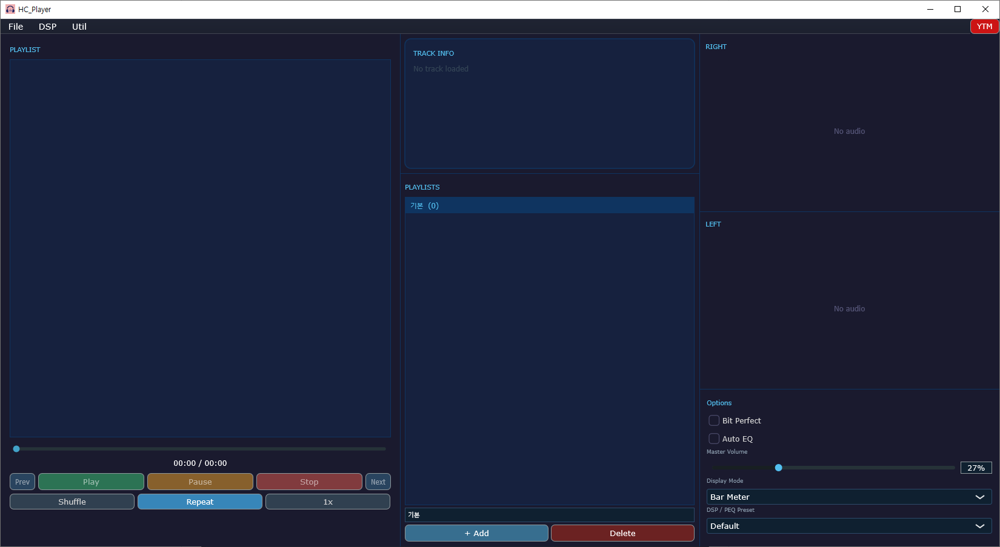

<h3>파일 추가</h3>

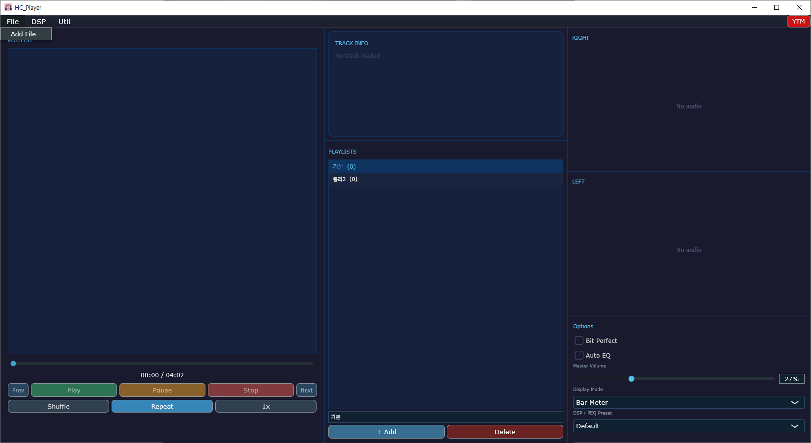

  

<h3>플레이 리스트 관리</h3>

플레이 리스트를 생성하고 삭제할 수 있습니다. 선택해서 비어 있는 플레이 리스트에 파일을 로드하면 해당 플레이 리스트에 곡이 들어갑니다.

**플레이 리스트1 선택**

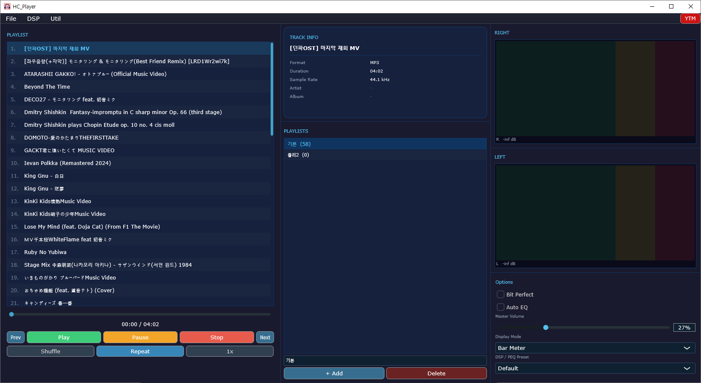

**플레이 리스트2 선택**

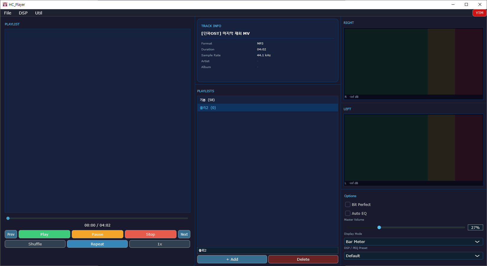

<h3>DSP</h3>

**DSP 는 PEQ와 Auto EQ가 있습니다.**

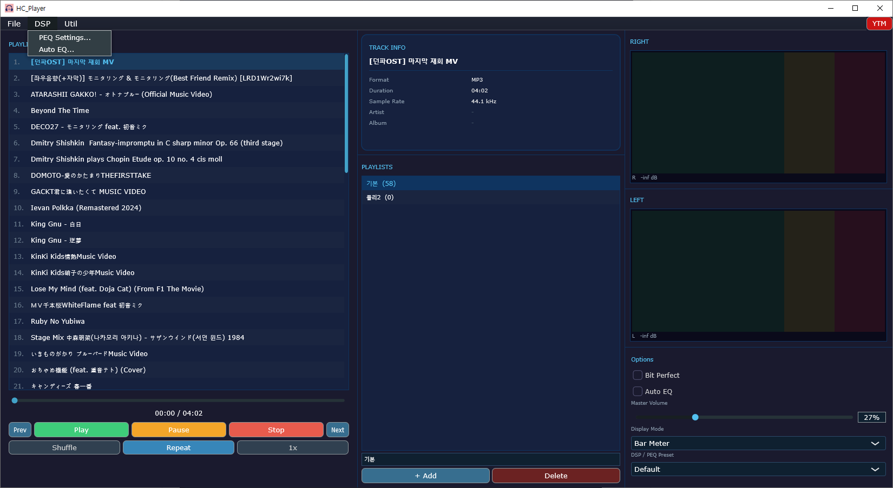

  

**PEQ 기본 화면 입니다. 여러 프리셋을 만들고 저장 및 불러오기가 됩니다. 기본값은 flat 입니다.**

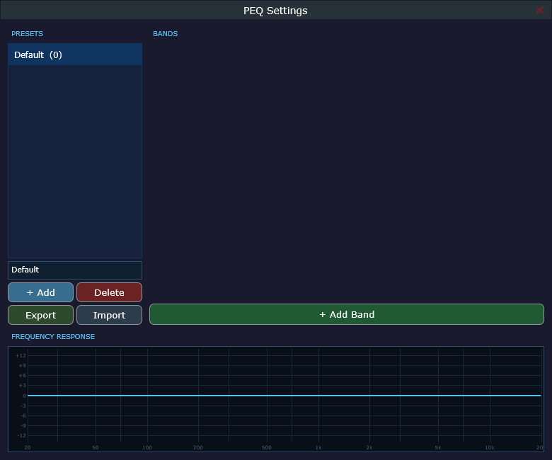

**PEQ 는 peak 외에도 간단한 옵션들이 더 있습니다.**

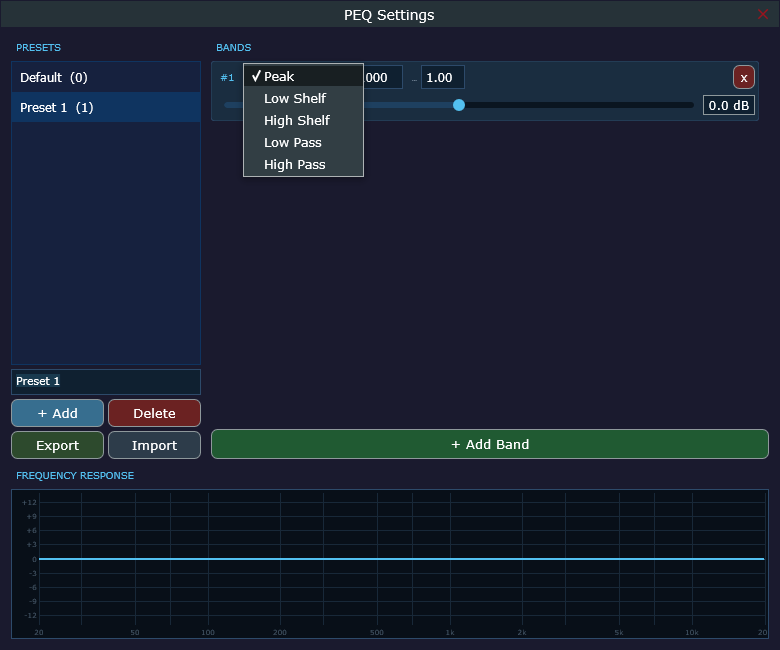

**PEQ 는 주파수대역, Q값 순서로 입력할 수 있고, FR결과를 시각화 해줍니다.**

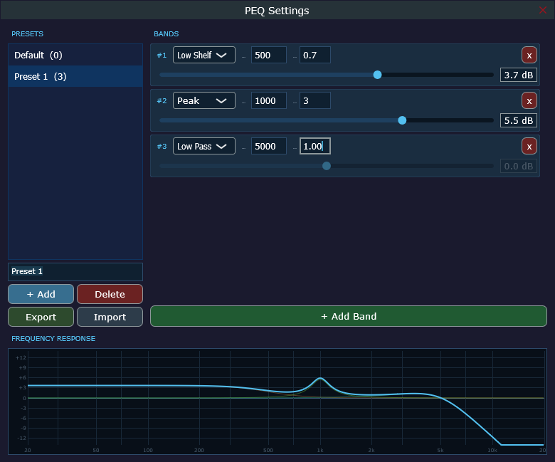

**불러오기 하면 기본값도 불러와지는 찐빠가 있는데 귀찮아서 안고칠 예정입니다.**
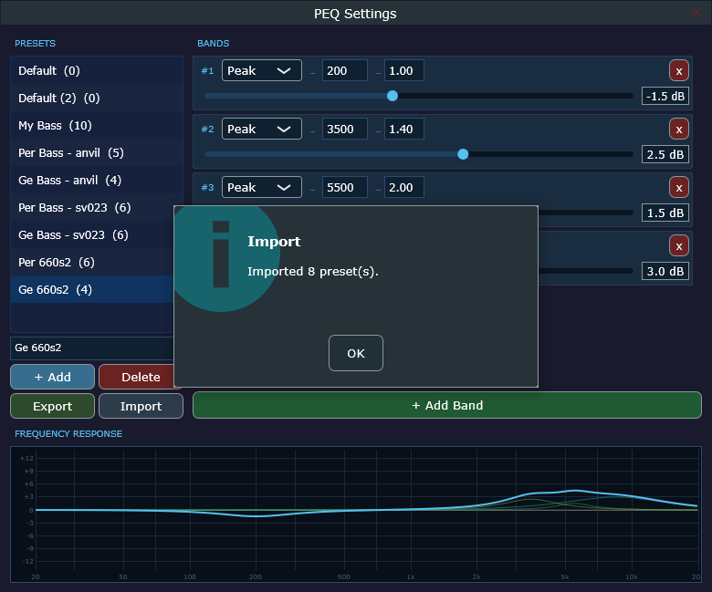

**AUTO EQ 는 갤럭시 버즈의 음질 최적화 기능처럼, 좌우 순음 청력 검사를 수행해서 진행합니다.**

$\color{red}{\text{음량의 절대값을 알 수 없으므로, 상대 음량으로 평가합니다. 테스트 수행전 적당히 작은 볼륨으로 설정하길 추천드립니다.}}$

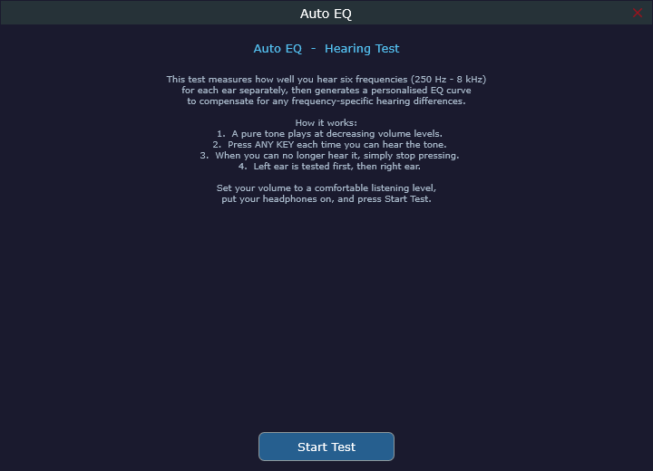

**좌우 보정값 FR 시각화가 나옵니다.**

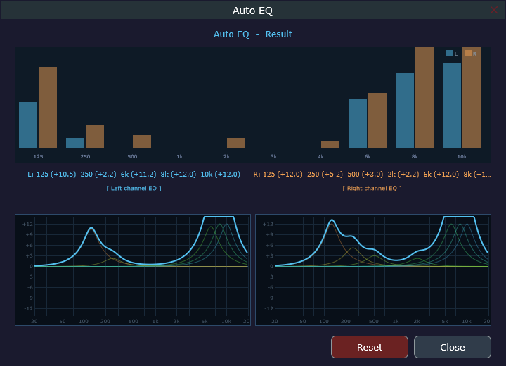

**대충 설명하자면, 잘 들리는 주파수를 기준으로 음량 차이를 보정해서 잘 못들은 주파수 대역을 부스팅해줍니다.**

<h3> 메인 화면 옵션 </h3>

**우측에 옵션칸이 있습니다. 비트 퍼펙트는 현재 출력기기로 WASAPI Exclusive Mode로 출력합니다.**

**Auto EQ 를 켤건지 말건지 설정할 수 있고, 설정된 EQ 값이 없으면 테스트 창으로 이동합니다.**

**Auto EQ 적용시 전체적으로 볼륨이 커지게 되니까 마스터 볼륨을 조절 하시는걸 추천드립니다.**

**Display Mode 는 아래와 같이 3개의 모드가 있습니다. 크게 중요하진 않습니다.**

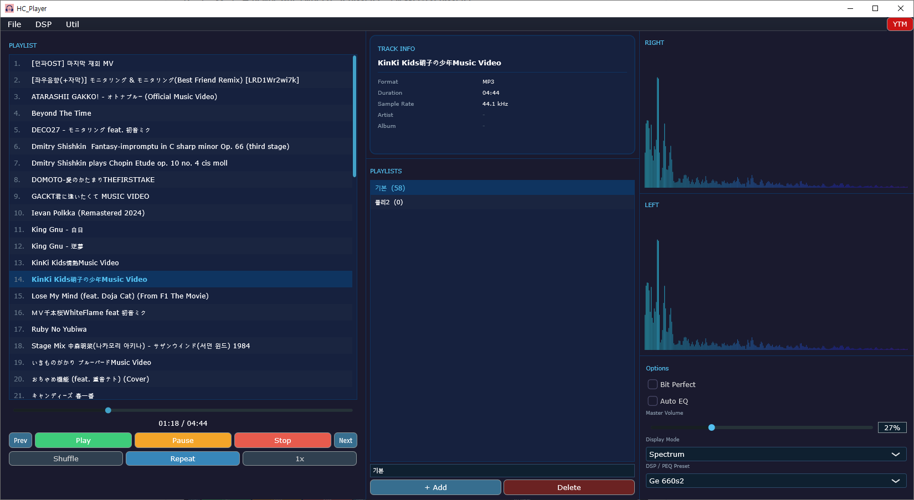

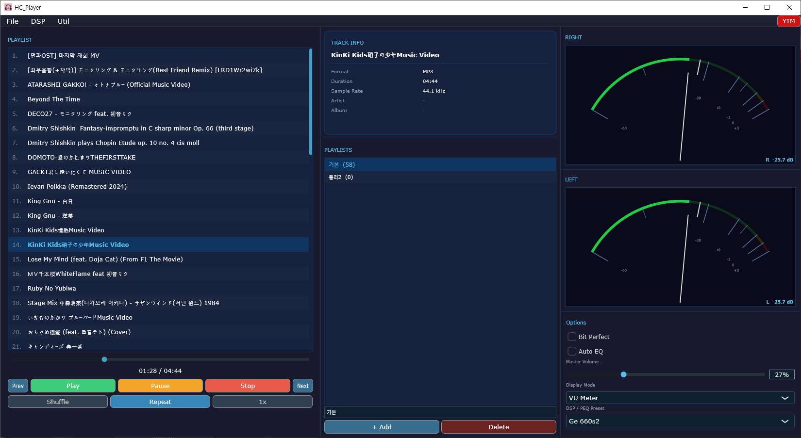

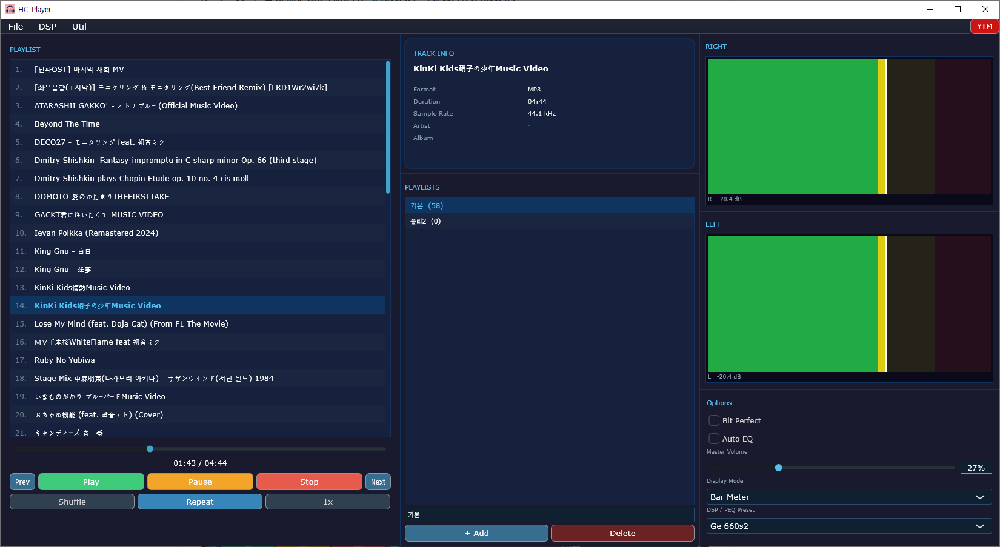

**그 아래에는 PEQ 프리셋을 선택 할 수 있습니다. PEQ 프리셋은 플레이 리스트마다 따로 기억됩니다.**

**마지막으로 우측 상단에 YMT 버튼은 유튜브 뮤직을 팝업으로 띄워줍니다. DSP는 전혀 먹지 않지만, 제가 사용하기 편하려고 넣어놨습니다.**

**유튜브 뮤직 최초 실행 시 로그인이 필요하고, 로그인 후 창을 껐다가 다시 켜면 유튜브 뮤직이 실행됩니다.**

$\color{red}{\text{해당 기능은 구글 정책을 우회하고 있으므로 찝찝하면 안쓰는걸 추천드립니다.}}$

**복잡한 프로그램 아닌데 이거 보고도 모르겠으면 물어보지말고 그냥 쓰지마세요.**

  
  
<h2>made by 후지단</h2>

**문의는 챈에서 호출**

족버그 아니면 귀찮아서 안 고칠 수 있음.

  
This software is licensed under CC BY-NC-ND 4.0.

https://creativecommons.org/licenses/by-nc-nd/4.0/
